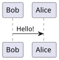
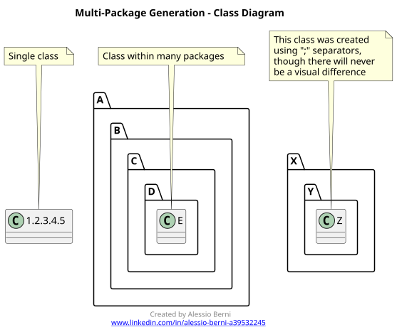
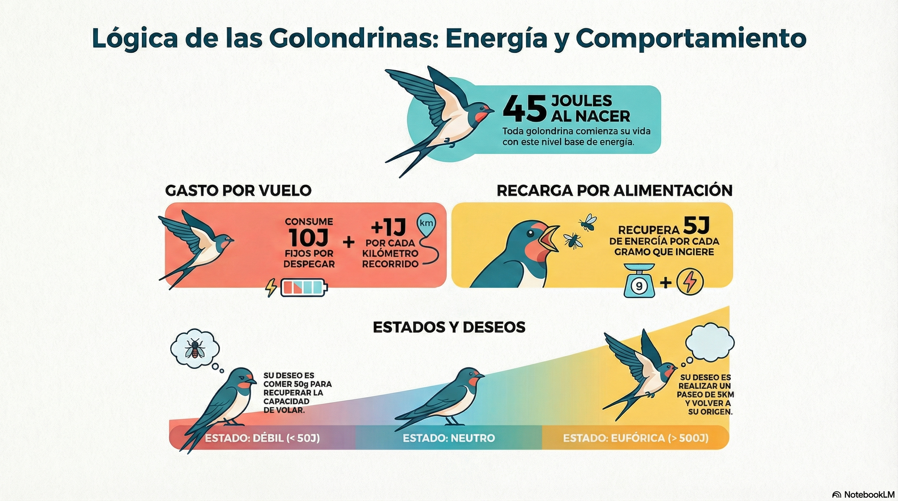

# Fechas En Java

Es un comparador y d un conversor de fechas en java.

## Documentación

- [Métodos ComparadorDeFechas](guia/Comparador_de_fechas.md)
- [Métodos ConversorDeFechas](guia/Conversor_de_fechas.md)
- [Cobertura de Tests](guia/Cobertura.md)

